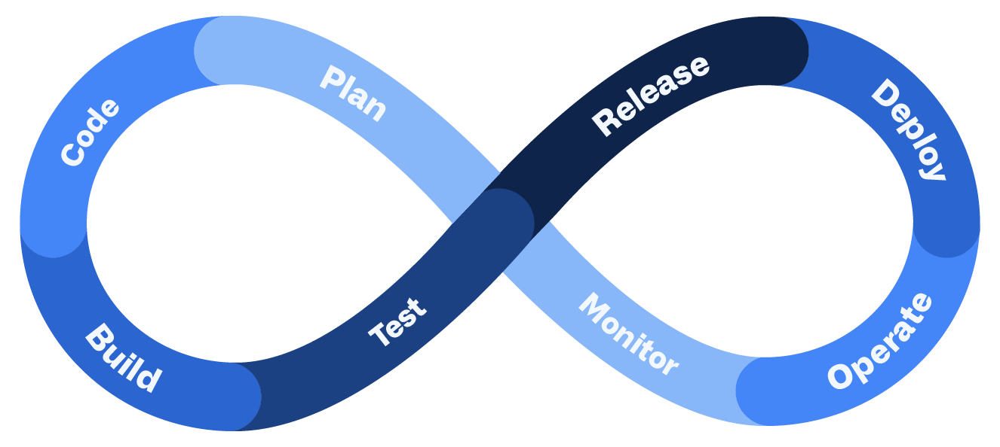

# DevSecOps
Shift left on security

[DevSecOps explained](https://resources.github.com/devops/fundamentals/devsecops/)

## Build stage

- Static application security testing (SAST)
- Software composition analysis (SCA) tool
    - To track open source components in the codebase and detect any vulnerabilities in dependencies

## Test stage
- DAST dynamic application security testing

## Operate and monitor
-  application-level and infrastructure metrics to identify unusual activity that could indicate a security breach

## Key components of the DevSecOps toolchain
- Code scanning
- Vulnerability scanning
- Secret scanning

# Tools
- Zed Attack Proxy (ZAP) for web scanning 
- Threat Dragon for threat modeling
- Sonarqube 

